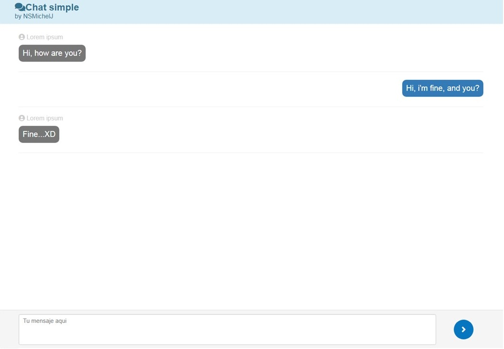

# Aplicación de chat simple
Creada con Python, Flask y Vue 

## Objetivo
Practicar el uso de los WebSockets

## Vista previa:

## Como utilizarla
Clona este repositorio:

`
git clone https://github.com/NSMichelJ/simple_chat_app_with_flask_and_vue.git
`

Instala las dependecias:

`
pip install requirements.txt
`

Ejecuta con:

`
python run.py
`

Navega a [localhost:5000/tu_nombre/](localhost:5000/tu_nombre/).